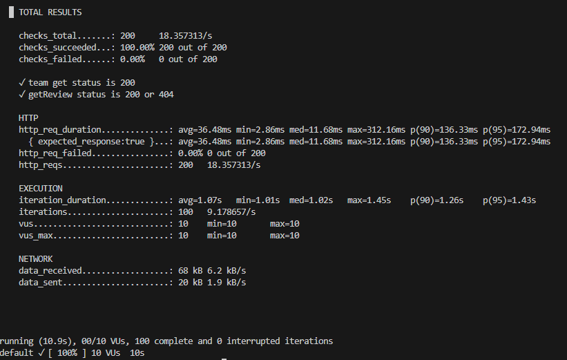
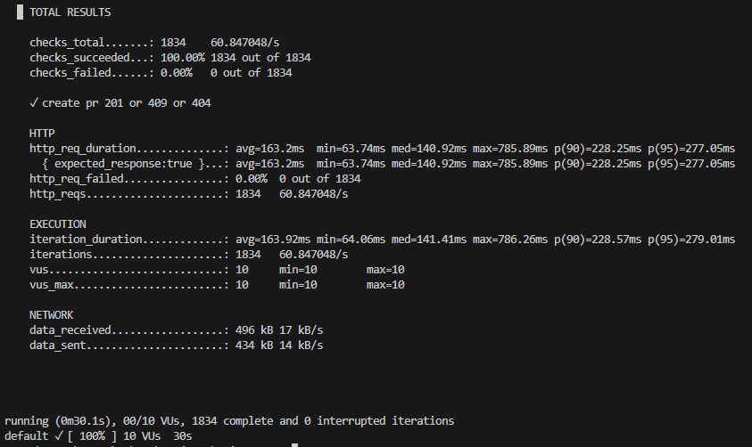
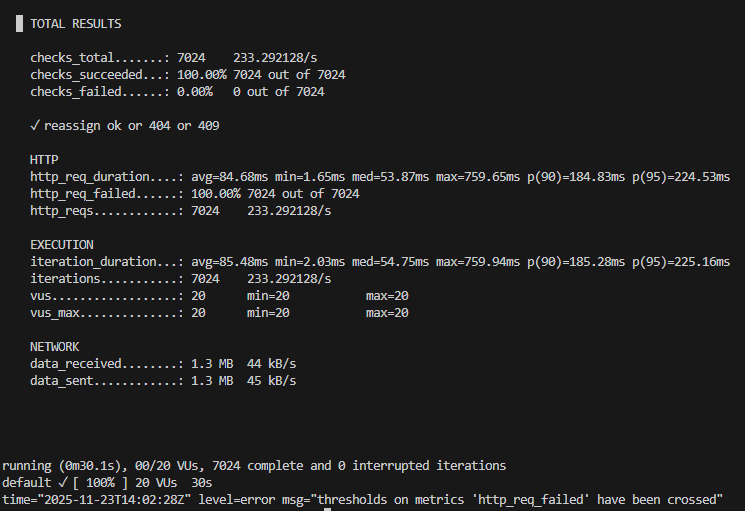
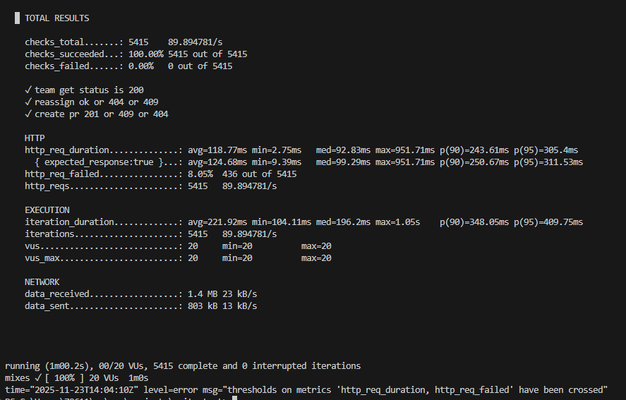
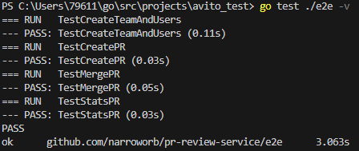

# Pull Request Review Service

## О проекте    
Это микросервис, который автоматически назначает ревьюеров на Pull Request’ы (PR), а также позволяет управлять командами и участниками. Взаимодействие происходит исключительно через HTTP API.


## Формулировка задания
Текст задания представлен в репозитории github:
https://github.com/avito-tech/tech-internship/blob/main/Tech%20Internships/Backend/Backend-trainee-assignment-autumn-2025/

## Как склонировать и запустить проект

```bash
git clone https://github.com/narroworb/pr-review-service.git
cd /pr-review-service
docker-compose up --build
```

## Стек технологий

- go 1.24.5
- go-chi
- PostgreSQL
- Docker
- grafana/k6

## Доступные эндпоинты

- /team/get?team_name=<название команды>
- /team/add
- /users/setIsActive
- /pullRequest/create
- /pullRequest/merge
- /pullRequest/reassign
- /users/getReview?user_id=<id пользователя>
- /stats/users
- /stats/teams
- /stats/pullRequests
- /team/deactivate
- /users/deactivate

Конфигурация API представлена в [api_config.yml](https://github.com/narroworb/pr-review-service/blob/main/api_config.yml)   

## Допущения

### 1. Может ли пользователь относится к нескольким командам?   
Принял допущение, что не может, поскольку иначе при переназначении ревьюеров могла бы возникнуть ситуация, при которой неясно в какой команде искать ревьюера.
### 2. В задании "Добавить метод массовой деактивации пользователей команды" нужно создать ручку, деактивирующую всех пользователей команды или деактивирующую всех пользователей из запроса?   
Принял решение сделать и то, и другое)   

## Тесты

### Нагрузочное тестирование 
Нагрузочное тестирование было реализовано при помощи инструмента grafana k6. Запускалось в докер контейнере. Конфигурации тестов были изложены в .js файлах. Тестовые данные лежат в папке /test_data (sql-скрипт на вставку данных).   
Файлы .js:
- smoke.js - быстрый и легкий тест (GET/POST проверка)
- create_pr.js — нагрузка на создание PR 
- reassign.js — нагрузка на переназначение ревьюеров
- combined.js — смесь различных запросов   

Загрузка тестовых данных
```bash
docker-compose up
docker exec -i prservice_postgres psql prservice -U pruser < ./test_data/insert_test_data.sql
```
Запуск тестов 
```bash
docker-compose up
docker run --rm -i --network host -v ${PWD}\loadtest:/loadtest -e BASE_URL=http://localhost:8080 grafana/k6 run /loadtest/<название тестового файла>
```
Результаты тестов





Все тесты прошли по заданным показателям: RPS (на скринах поле http_reqs) — 5, SLI времени ответа (на скринах поле http_req_duration) — 300 мс, SLI успешности (на скринах поле checks_succeeded или 100%-http_req_failed (там, где не установлены чеккеры)) — 99.9%.  

### E2E тестирование 

В пакете e2e реализовано e2e-тестирование (последовательные операции создания команды и пользователей, получения информации о команде, создания Pull Request, merge Pull Request, переназначения после мержа, получения статистики по pull request)   

Все тесты проходят:   
   

Запуск тестов:   
```bash
docker-compose up
go test ./e2e -v
```

